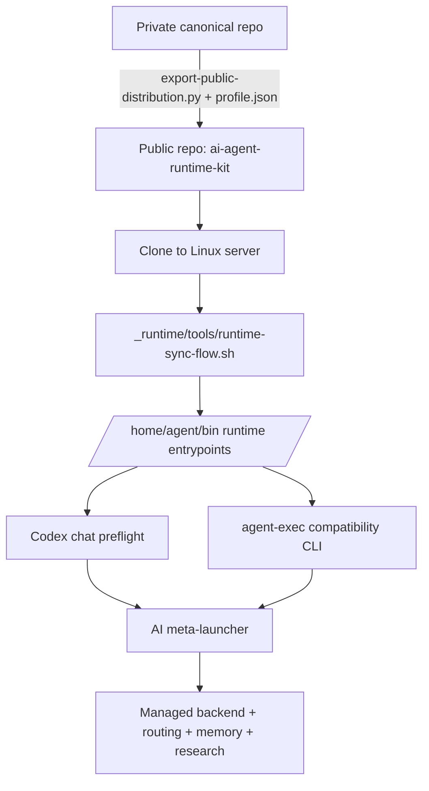

# AI Agent Runtime Kit

Installable Linux runtime kit for running a governed AI-agent server, with one primary chat entry path plus a compatibility CLI for automation and fallback use.

## Who This Is For

- technical users who are comfortable with Linux, Bash, and Python
- operators who want a reusable server-side AI-agent runtime instead of a one-off chat setup
- people who want one governed entry path for routing, memory, research, and runtime execution

## Who This Is Not For

- users looking for a turnkey consumer chatbot
- teams that want a no-shell SaaS product
- projects that only need a single prompt file or a minimal API wrapper

## What Problem It Solves

This kit gives you one installable runtime path for substantial AI-agent work on a server, so the operator does not need to remember separate workflow classes, launcher chains, memory wiring, or research routing by hand.

## What's Included

- a governed runtime mirror under `_runtime/`
- Codex chat preflight and CLI entrypoints for the managed runtime
- core orchestration logic under `core/`
- shared rules, templates, and research helpers under `_shared/`
- optional MCP/tool integration surface under `mcp/`
- install, reconstruct, and operator guidance

## What's Not Included

- personal topic history
- private memory or vault data
- private credentials or auth material
- bulky run traces or local-only dumps
- unrelated application projects

## 3-Step Quickstart

```bash
export AGENT_REPO_ROOT="${AGENT_REPO_ROOT:-/home/agent/agents}"
export AGENT_BIN_DIR="${AGENT_BIN_DIR:-/home/agent/bin}"

git clone https://github.com/ag-foundry/ai-agent-runtime-kit.git "$AGENT_REPO_ROOT"
cd "$AGENT_REPO_ROOT"
mkdir -p "$AGENT_BIN_DIR"
bash _runtime/tools/runtime-sync-flow.sh
```

Then validate the primary entrypoints:

```bash
"$AGENT_BIN_DIR/codex-frontdoor-preflight" --help
"$AGENT_BIN_DIR/agent-exec" --help
```

## Start Here

- installation guide: `INSTALL.md`
- reconstruction guide: `RECONSTRUCT.md`
- operator modes: `OPERATOR-MODES.md`
- runtime sync workflow: `_runtime/RUNTIME_SYNC_WORKFLOW.md`

## Architecture Overview



## Trust Signals

- public scope is intentionally filtered from a private canonical source of truth
- install, reconstruct, and operator docs are included
- no private topic history or secrets are shipped here
- runtime/chat-entry relationship is explicit rather than hidden behind docs-only claims

## Honest Limits

- the default supported layout is still `/home/agent/agents` plus `/home/agent/bin`
- the main runtime tools support `AGENT_REPO_ROOT` and `AGENT_BIN_DIR`, but some deeper auxiliary scripts still assume the default layout
- local generated runtime metadata stays outside the tracked public baseline
- this repo is an installable runtime kit, not the maintainer's full private recovery archive
